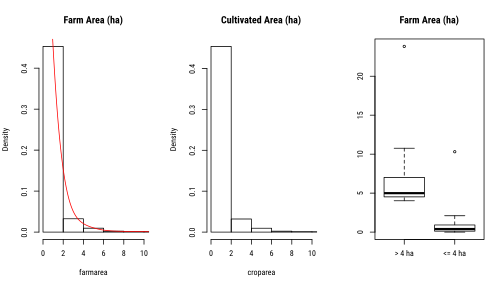

--------------------------------------------------------------------------------------

```{r setup, echo=FALSE}

library(data.table)
library(rhandsontable)
library(jsonlite)
library(knitr)

load("../tmp/2017-agra-aasr.RData")

```


```{r, eval=FALSE}

library(data.table)
library(foreign)
library(stringr)
library(rhandsontable)
library(jsonlite)

setwd("~/Google Drive/2017-AGRA")
load("./tmp/2017-agra-aasr.RData")

#####################################################################################
# Helper - Construct variable summary
summaryTable <- function(dt) {
  
  dt.lbl <- data.table(
    varCode=names(dt),
    varLabel=attr(dt, "var.labels")
  )  
  tmp <- as.data.table(summary(dt))
  tmp[, V1 := 1:7]
  tmp <- dcast(tmp, V2~V1)
  setnames(tmp, c("varCode", "Min.", "1st Qu.", "Median", "Mean", "3rd Qu.", "Max.", "NA's"))
  tmp[, varCode := str_trim(varCode)]
  
  setkey(tmp, varCode)
  setkey(dt.lbl, varCode)
  dt.lbl <- tmp[dt.lbl]
  dt.lbl <- dt.lbl[names(dt)]
  
  dt.lbl[, `Hist.` := sapply(dt, function(x) ifelse(class(x)=="numeric", toJSON(list(values=hist(x, plot=FALSE)$counts)), toJSON(NA)))]
  
  setcolorder(dt.lbl, c(1,9,10,2:8))
  
  return(dt.lbl)
}
#####################################################################################

# Load dataset #1 (variables extracted for the Poverty, Land, Climate paper)
hh1 <- read.dta("./tmp/Final_SSA_hhPOV_ 6 Apr 2016.12.dta")
hh.dim <- list(hh1=dim(hh1))

# Show summaries
hh1.lbl <- summaryTable(hh1)
hh1 <- data.table(hh1)

# List surveys/years included in this set
dt1.sum <- hh1[, .(
  Regions=uniqueN(svyL1Cd), 
  Districts=uniqueN(paste(svyL1Cd, svyL2Cd)), 
  Obs=.N), keyby=.(ISO3, Year=as.integer(year))]
dt1sum <- rhandsontable(dt1.sum, rowHeaders=NULL, height=600, width="auto")
rm(hh1)

# Describe variables
dt1var <- rhandsontable(hh1.lbl, rowHeaders=NULL, height=600, width="auto") %>%
  hot_col("Hist.", renderer=htmlwidgets::JS("renderSparkline")) %>%
  hot_cols(fixedColumnsLeft=1)

# Load dataset #2 (HarvestChoice Ag Snapshots)
hh2 <- read.dta("./tmp/Combined_Regdemovars13.12.dta")
hh.dim$hh2 <- dim(hh2)

# Summarize
hh2.lbl <- summaryTable(hh2)
hh2 <- data.table(hh2)

# List surveys/years included in this set
dt2.sum <- hh2[, .(
  Regions=uniqueN(svyL1Cd), 
  Obs=.N), keyby=.(ISO3, Year=as.integer(year))]
dt2sum <- rhandsontable(dt2.sum, rowHeaders=NULL, height=600, width="auto")
rm(hh2)

# Describe variables
dt2var <- rhandsontable(hh2.lbl, rowHeaders=NULL, height=600, width="auto") %>%
  hot_col("Hist.", renderer=htmlwidgets::JS("renderSparkline")) %>%
  hot_cols(fixedColumnsLeft=1)

# Load dataset #3 (Beliyou's Resilience Study)
hh3 <- read.dta("./tmp/Combined_4_Mel.12.dta")
hh.dim$hh3 <- dim(hh3)

# Summarize
hh3.lbl <- summaryTable(hh3)
hh3 <- data.table(hh3)

# List surveys/years included in this set
dt3.sum <- hh3[, .(
  Regions=uniqueN(region), 
  Districts=uniqueN(paste(region, district)), 
  Obs=.N), keyby=.(ISO3, Year=as.integer(year), round)]
dt3sum <- rhandsontable(dt3.sum, rowHeaders=NULL, height=600, width="auto")
rm(hh3)

# Describe variables
dt3var <- rhandsontable(hh3.lbl[1:150], rowHeaders=NULL, height=600, width="auto") %>%
  hot_col("Hist.", renderer=htmlwidgets::JS("renderSparkline")) %>%
  hot_cols(fixedColumnsLeft=1)

# Load dataset #4 (SSA Poverty)
hh4 <- read.dta("./tmp/SSApoverty_Dist_forGWR.12.dta")
hh.dim$hh4 <- dim(hh4)

# Keep labels
hh4.lbl <- data.table(varCode=names(hh4), varLabel=attr(hh4, "var.labels"))

# Remove dummy vars
hh4 <- hh4[, !names(hh4) %like% "ctry"]
hh4 <- hh4[, !names(hh4) %like% "yr"]
hh4 <- hh4[, !names(hh4) %like% "fs"]
setkey(hh4.lbl, varCode)
hh4.lbl <- hh4.lbl[names(hh4)]
attr(hh4, "var.labels") <- hh4.lbl$varLabel

# Correct types
for (i in names(hh4)) if (class(hh4[[i]])=="numeric") hist(hh4[[i]], plot=F)
hh4[[i]] <- as.character(hh4[[i]])

# Summarize
hh4.lbl <- summaryTable(hh4)
hh4 <- data.table(hh4)

# List surveys/years included in this set
dt4.sum <- hh4[, .(
  Regions=uniqueN(svyL1Cd), 
  Districts=uniqueN(paste(svyL1Cd, svyL2Cd)), 
  Obs=.N), keyby=.(ISO3, Year=as.integer(year))]
dt4sum <- rhandsontable(dt4.sum, rowHeaders=NULL, height=600, width="auto")
rm(hh4)

# Describe variables
dt4var <- rhandsontable(hh4.lbl, rowHeaders=NULL, height=600, width="auto") %>%
  hot_col("Hist.", renderer=htmlwidgets::JS("renderSparkline")) %>%
  hot_cols(fixedColumnsLeft=1)


# Load GHA GLSS rounds (Eduardo)

# Save workspace
rm(i, x, tmp)
save.image("./tmp/2017-agra-aasr.RData")

```

# Background

This study is a prospective chapter in *AGRA Africa Agriculture Status Report (AASR) 2017*.

The overall objective of the AASR report is to [@aasr_cn_2017]:  
 
1. provide an overview of the smallholder farmers and how they have adapted to the challenges they face as economic actors; 
2. explore innovative strategies that can substantially raise the productivity and incomes of smallholder farmers; 
3. identify policies and programs that can support the movement of Africa’s farming systems from subsistence-oriented to market-oriented thriving businesses; 
4. identify the necessary conditions, appropriate technologies, and institutions that can propel and support smallholder agriculture businesses; 
5. examine the past and the present role of public and private sector investment in agriculture and the success factors that can be scaled up to accelerate transformation.  

# Method

The study should provide a context-setting chapter that attempts to characterize, scale, locate, point to prioritization of high-level smallholder commercialization strategies, opportunities and challenges. A proposed approach is to chracterize SHFs and frame business strategies within a 2-by-2 domain framework (low/high rainfed ag potential across low/high market access areas). This approach assumes that agricultural development and adaptation strategies are largely driven by pre-existing bio-physical and spatial conditions.

We propose then focusing on around half a dozen countries for which we have recent/accessible microdata (e.g. LSMS-ISA and maybe AGRA baseline surveys) to look more closely, in the same 2x2 domain framework, at specific farm household and macro characteristics to do two things:  

1. Apply some typology to distinguish between say “predominantly-subsistence” focused and “transitioning-commercial” smallholders  
2. Report on hh level variables that can provide insight into the scale of potential business development challenges and opportunities in each country. 

Key farm and household-level variables to look at may include:

* Holding size
* Income/consumption
* Access to inputs/extension
* Use of inputs
* Land tenure status
* Education
* Cell-phone ownership
* Cooperative/self-help group membership
* Access to credit, insurance
* Off-farm income
* ...

# Supporting Datasets

Many (unpublished and mostly country-level) studies have attempted to derive farmer characteristics and farm typologies across geospatial dimensions (see e.g. refs below). IFPRI in particular generated cross-country comparable household variables (derived from World Bank LSMS-ISA panels, Demographic and Health Surveys, and/or other large-scale household surveys and agricultural census).

## Cross-Country Harmonized Variables

Inventory and summarize the latest versions of IFPRI's harmonized variables. Some of these variables are also available (summarized) across districts and/or regions and/or gender.

### Dataset #1 (Poverty, Land, Climate paper)

This dataset contains `r hh.dim$hh1[2]` variables and `r hh.dim$hh1[1]` observations. The breakdown across countries and survey years is as follows, and variables are further described in the next table. Many of these variables are also documented in @azzarri2016poverty.

```{r}

dt1sum

```
      

```{r}

dt1var

```

### Dataset #2 (HarvestChoice Agricultural Snapshots)

My copy of the household-level file is corrupt (would need to contact IFPRI directly) but the variables are similar in the region-level file.

This dataset contains `r hh.dim$hh2[2]` variables. The breakdown across countries and survey years is as follows, and variables are further described in the next table.

```{r}

dt2sum

```


```{r}

dt2var

```


### Dataset #3 (Panels for Resilience Study)

This dataset contains `r hh.dim$hh3[2]` variables and `r hh.dim$hh3[1]`  observations. The breakdown across countries and survey years is as follows, and variables are further described in the next table.

```{r}

dt3sum

```

This dataset also includes over 2,000 constructed climatic variables (monthly SPEI, temperature, rainfall, PDSI, etc.). To save space they are not shown in the variable summary below.

```{r}

dt3var

```

### Dataset #4 (SSA Poverty Regressions)

This dataset contains `r hh.dim$hh4[2]` variables and `r hh.dim$hh4[1]` observations. The breakdown across countries and survey years is as follows, and variables are further described in the next table. This is a district-level dataset (IFPRI holds the hh-level variables).

```{r}

dt4sum

```

```{r}

dt4var

```

## Demographic and Health Surveys (harmonized)

IFPRI holds cross-country harmonized variables from the latest DHS. Complete metadata is in a [DHS Google Sheet](https://docs.google.com/spreadsheets/d/1v8DDLgi9lQbS4uKnxYPM83PYC90rijJvjKN4xAntKlE/edit#gid=916658631). We would need to request access to the CHILD and WOMAN recodes, I only have the STRATA summaries.


## Other Country-Level Panel Variables

### Ghana GLSS Rounds

(as needed). Eduardo has 3 rounds (2005, 2008, 2012) of harmonized variables focused on wages/productivity.

### Nigeria Farm Segmentation Study

(as needed)

# Definition of Smallholdings

## Nigeria

In the following we define **smallholding** as a farm with total cultivated area **less or equal to 4 ha**. We look at the distributions of the following variables. Note that all value variables have been generated using the RIGA method.

* $farmarea$ farm size (incl. parcels rented out)
* $croparea$ cultivated area
* $cropsold$ annual value of crops and crop byproducts sold (per RIGA method)
$$ cropsold = cropsold+agbyprodincimp-reimbursmt\_n-gift\_n $$ 
* $lstocksold$ annual value of livestock products and byproducts sold
$$ lstocksold=livstrevgrossimp+livstbyprodimp  $$
* $agsales$ farm sales, i.e. combined value of crop, livestock, and fish products sold
$$ agsales=cropsold+lstocksold+fishsold $$
* $agsalespc$ farm sales per adult equivalent
$$ agsalespc=\frac{agsales}{equiv} $$
* $aggross$ farm income (includes value of own consumption, ag wages and ag rents)
$$ aggross=agsales+agr\_wge+farmrntimp+agrentimp+cropownimp $$
* $totgross$ total gross income (incl. farm income, non-farm income, transfers)
$$ totgross=aggross+nonagr\_wge+other+privtransfer+pubtransfer+self $$
* $agshare$ share of farm income in total household income
$$  agshare=\frac{aggross}{totgross} $$
* $commrate\_crop$ commercialization rate for crops, defined as:
$$ commrate\_crop = \frac{cropsold}{cropsold+cropownimp} $$ 
* $TLU\_total$ and $TLU\_total\_imp$ tropical livestock units (combines all animals)


```{r, eval=FALSE}

# Load data extracts from the 2016 NGA Segmentation
setwd("~/Google Drive/2016-BMGF-Segmentation/NGA")
load("./temp/nga_bmgf_seg_1.RData")
setwd("~/Google Drive/2017-AGRA")

# SHF 4ha dummy
farm[, croparea_4ha := factor(croparea <= 4, labels=c("> 4 ha", "<= 4 ha"))]

# Merge into `ghs`
setkey(ghs, hhid)
setkey(farm, hhid)
ghs[farm, croparea_4ha := croparea_4ha]
ghs[farm, croparea := croparea]
ghs[is.na(croparea_4ha), .N]
ghs[is.na(croparea), .N]

# Commercialization rate
ghs[, comm_rate_crop := nona(cropsold)/(nona(cropsold)+nona(cropownimp))]
summary(ghs$comm_rate_crop)
#   Min. 1st Qu.  Median    Mean 3rd Qu.    Max.    NA's 
# 0.0000  0.0000  0.0005  0.1037  0.0072  1.0000    1778 

# Define survey design (use last GHS wave only)
ghs.svy <- svydesign(~hhid, strata=~zone+rural, weights=~wt_wave2, data=ghs[!is.na(wt_wave2)])
farm.svy <- svydesign(~hhid, strata=~zone+sector, weights=~wt_wave2, data=farm[!is.na(wt_wave2)])

# Subset survey sample to SHF
summary(ghs$croparea_4ha)
# > 4 ha <= 4 ha    NA's 
#     94    2847    1939

ghs[is.na(croparea) & TLU_total > 0, .N]
# 142

ghs.svy.shf <- subset(ghs.svy, croparea <= 4)

svymean(~farm_hh, ghs.svy, na.rm=T)
# 57%

svymean(~croparea_4ha, ghs.svy, na.rm=T)
# 97%

svytotal(~farm_hh, ghs.svy, na.rm=T)
#                 total     SE
# farm_hhFALSE 14069666 329673
# farm_hhTRUE  18666138 276494

svytotal(~farm_hh, ghs.svy.shf, na.rm=T)
#                 total     SE
# farm_hhFALSE        0      0
# farm_hhTRUE  16111650 248682

svytotal(~hhsize, ghs.svy.shf, na.rm=T)
#            total      SE
# hhsize 106640203 1923843

# Quick compare `farmarea` and `croparea` 
svg("./out/nga-2012_hist-area.svg", family="Roboto Condensed", height=4)
par(mfrow=c(1,3))
svyhist(~farmarea, ghs.svy, main="Farm Area (ha)", xlim=c(0,10))
lines(svysmooth(~farmarea, ghs.svy, bandwidth=1), lwd=1, col="red")
svyhist(~croparea, ghs.svy, main="Cultivated Area (ha)", xlim=c(0,10))
svyboxplot(farmarea~croparea_4ha, ghs.svy, main="Farm Area (ha)")
dev.off()

# croparea
svg("./out/nga-2012_hist-croparea.svg", family="Roboto Condensed", height=5)
par(mfrow=c(1,2))
svyhist(~croparea, ghs.svy.shf, main="Cultivated Area (ha)", xlab="ha")
lines(svysmooth(~croparea, ghs.svy.shf, bandwidth=1), lwd=1, col="red")
plot(svycdf(~croparea, ghs.svy.shf), main="Cultivated Area (ha)", xlab="ha")
abline(h=0.5, lty=2, col="red")
abline(h=0, lty=2, col="grey70")
abline(h=1, lty=2, col="grey70")
dev.off()

# farmarea
svg("./out/nga-2012_hist-farmarea.svg", family="Roboto Condensed", height=5)
par(mfrow=c(1,2))
svyhist(~farmarea, ghs.svy.shf, main="Farm Size (ha)", xlab="ha")
lines(svysmooth(~croparea, ghs.svy.shf, bandwidth=1), lwd=1, col="red")
plot(svycdf(~farmarea, ghs.svy.shf), main="Farm Size (ha)", xlab="ha")
abline(h=0.5, lty=2, col="red")
abline(h=0, lty=2, col="grey70")
abline(h=1, lty=2, col="grey70")
dev.off()

# comm_rate_crop
svg("./out/nga-2012_hist-comm_rate_crop.svg", family="Roboto Condensed", height=5)
par(mfrow=c(1,2))
svyhist(~comm_rate_crop, ghs.svy.shf, main="Crop Commercialization", xlab="share", freq=T)
lines(svysmooth(~comm_rate_crop, ghs.svy.shf, bandwidth=.1), lwd=1, col="red")
plot(svycdf(~comm_rate_crop, ghs.svy.shf), main="Crop Commercialization", xlab="share")
abline(h=0.5, lty=2, col="red")
abline(h=0, lty=2, col="grey70")
abline(h=1, lty=2, col="grey70")
dev.off()

# lstocksold
svg("./out/nga-2012_hist-lstocksold.svg", family="Roboto Condensed", height=5)
par(mfrow=c(1,2))
svyhist(~lstocksold, ghs.svy.shf, main="Sales of Livestock Products", xlab="LCU")
#lines(svysmooth(~lstocksold, ghs.svy.shf), lwd=1, col="red")
plot(svycdf(~lstocksold, ghs.svy.shf), main="Sales of Livestock Products", xlab="LCU")
abline(h=0.5, lty=2, col="red")
abline(h=0, lty=2, col="grey70")
abline(h=1, lty=2, col="grey70")
dev.off()

# TLU_total
svg("./out/nga-2012_hist-TLU_total.svg", family="Roboto Condensed", height=5)
par(mfrow=c(1,2))
svyhist(~TLU_total, ghs.svy.shf, main="Total TLU", xlab="", breaks=seq(0,251,5), xlim=c(0,50))
#lines(svysmooth(~TLU_total, ghs.svy.shf), lwd=1, col="red")
plot(svycdf(~TLU_total, ghs.svy.shf), main="Total TLU", xlab="")
abline(h=0.5, lty=2, col="red")
abline(h=0, lty=2, col="grey70")
abline(h=1, lty=2, col="grey70")
dev.off()

# agshare
svg("./out/nga-2012_hist-agshare.svg", family="Roboto Condensed", height=5)
par(mfrow=c(1,2))
svyhist(~agshare, ghs.svy.shf, main="Share of Farm Income", xlab="share")
lines(svysmooth(~agshare, ghs.svy.shf, bandwidth=0.1), lwd=1, col="red")
plot(svycdf(~agshare, ghs.svy.shf), main="Share of Farm Income", xlab="share")
abline(h=0.5, lty=2, col="red")
abline(h=0, lty=2, col="grey70")
abline(h=1, lty=2, col="grey70")
dev.off()

# Gross ag income
tmp <- ghs[!is.na(wt_wave2) & farmarea<=4, sum(aggross*wt_wave2, na.rm=T)/1e+9, keyby=croparea <= 4]

# Livestock TLU
tmp <- ghs[!is.na(wt_wave2), sum(TLU_total*wt_wave2, na.rm=T), keyby=croparea <= 4]

# Cultivated area
tmp <- farm[!is.na(wt_wave2), sum(croparea*wt_wave2, na.rm=T), keyby=croparea <= 4]

# Demographics
tmp <- ghs[!is.na(wt_wave2), lapply(.SD, weightedMean, wt_wave2, na.rm=T),
  .SDcols=c("wt_wave2", "hhsize", "agehead", "lithead", "eduyears", "numchildren",
    "equiv", "females", "males", "sh_ed_none", "sh_ed_prim", "sh_ed_high"),
  keyby=croparea <= 4][, wt_wave2 := NULL]

# SE
tmp <- svyby(~farmarea, ~croparea <= 4, ghs.svy, svymean, na.rm=T)

# Population
tmp <- ghs[!is.na(wt_wave2), sum(wt_wave2*hhsize, na.rm=T), keyby=croparea <= 4]

# Farms statistics
tmp <- ghs[!is.na(wt_wave2) & farm_hh==T, .(
    f2malehh_tot=sum(femhead*wt_wave2, na.rm=T),
    malehh_tot=sum(-(femhead-1)*wt_wave2, na.rm=T),
    femalehh=weightedMean(femhead, wt_wave2, na.rm=T),
    hasland=weighted.mean(farmarea>0, wt_wave2, na.rm=T),
    farmarea=weightedMean(hectares_1_hh_farmer, wt_wave2, na.rm=T),
    farmarea_med=weightedMedian(hectares_1_hh_farmer, wt_wave2, na.rm=T)
  ), keyby=croparea <= 4]

tmp <- farm[, .(
    farmslive_tot=sum(farmslive*wt_wave2, na.rm=T),
    farmslive=weightedMean(farmslive, wt_wave2, na.rm=T),
    intens_idx2=weightedMean(intens_idx2, wt_wave2, na.rm=T),
    intens_idx2_med=weightedMedian(intens_idx2, wt_wave2, na.rm=T)
  ), keyby=croparea <= 4]

# Livestock
tmp <- ghs[!is.na(wt_wave2) & totgross > 0, .(
    TLU_total=sum(TLU_total, wt_wave2, na.rm=T),
    TLU_hh=weightedMean(TLU_total, wt_wave2, na.rm=T),
    TLU_hh_imp=weightedMean(TLU_total_imp, wt_wave2, na.rm=T)
  ), keyby=croparea <= 4][, wt_wave2 := NULL]

# Income
tmp <- ghs[!is.na(wt_wave2) & farm_hh==T, lapply(.SD, weightedMean, wt_wave2, na.rm=T),
  .SDcols=c("wt_wave2", "agsales", "aggross", "totgross", "agshare"),
  keyby=croparea <= 4][, wt_wave2 := NULL]

# Input uses
tmp <- farm[, lapply(.SD, weightedMean, wt_wave2, na.rm=T),
  .SDcols=c("wt_wave2", "parcels", "sh_chempest", "sh_chemherb", "sh_fertorg",
    "sh_fertinorg", "sh_seedp", "tractorown_farms"),
  keyby=croparea <= 4][, wt_wave2 := NULL]

# Poverty
vars <- c("weight", names(ppp12)[names(ppp12) %like% "ppp"])
tmp <- ppp12[, lapply(.SD, weightedMean, weight, na.rm=T), .SDcols=vars,
  keyby=croparea <= 4][, weight := NULL]

``` 

Below is the estimated distribution of farm size and cultivated area in the entire population.

```{r}



```

Using the **<= 4 ha** definition above, for Nigeria we estimate as of 2012:

* there are **19M** farm holdings in Nigeria
* **97%** of farm holdings are small (**16M**)
* corresponding to a beneficiary population of **106M**

The subsample of small farmholdings is characterized as follows.

```{r}

include_graphics(c(
  "../out/nga-2012_hist-croparea.svg",
  "../out/nga-2012_hist-farmarea.svg",
  "../out/nga-2012_hist-comm_rate_crop.svg",
  "../out/nga-2012_hist-lstocksold.svg",
  "../out/nga-2012_hist-TLU_total.svg",
  "../out/nga-2012_hist-agshare.svg"
))

```


## Ethiopia 


# Quadrant Classification

## Nigeria

For documentation purposes below are code snippets from the 2016 Farmer Segmentation for Nigeria (definitions and characterization of quadrants and livelihood zones).


```{r, eval=FALSE}

#####################################################################################
# 2016.05.03 Quadrant Definitions across Livelihood Zones (from Diemuth 2016.04.06)
#####################################################################################
# We need to add a new segment vars to all key micro datasets, starting with GHS.
# Diemuth provided latest quadrant definitions.
#
#  - [country]_agpotallclass_1km.tif – Agricultural potential raster with 1km cell
# resolution and same extent as ethtt_1km100khr. Created from clipping sub-Saharan Africa
# Agricultural Potential 5 minute grid vector layer from FAO & IIASA, 2007. For the
# 2x2 segmented data, 5-6 values were considered high, 1-4 low and -809-0 were
# unsuitable and -997 were water.
# -997 = Water
# -809 = Protected Areas
# -807 = Urban Areas
# -805 = Irrigated Areas
# -801 = Forest
# 0 = Land not suited for agriculture
# 1 = Land very poorly suited for pasture and at best poorly suited for rainfed crops
# 2 = Land poorly suited for pasture and at best poorly suited for rainfed crops
# 3 = Lands suited for pasture and at best poorly suited for rainfed crops
# 4 = Land suited for rainfed crops and pasture possible
# 5 = Land well suited for rainfed crops and pasture possible
# 6 = Prime land suited for rainfed crops and pasture possible
#
# - [country]_tt1km100khr_4hr.tif – Classified travel time raster with a 4 hr threshold,
# HarvestChoice, 2015
# 100 – travel time greater than 4 hours, lo access
# 200 – travel time less than or equal to 4 hours, high access

# Load the 2 rasters and classify LGAs
qd.agpot <- raster("./maps/quadrant/nga_agpotallclass_1km.tif")
qd.tt100k <- raster("./maps/quadrant/nga_tt1km100khr_4hr.tif")
proj4string(qd.agpot)
proj4string(qd.tt100k)
proj4string(geo12.pts)
unique(qd.agpot)
#  [1] -997 -809 -807 -805 -801    0    1    2    3    4    5    6
summary(qd.tt100k)
#         nga_tt1km100khr_4hr
# Min.                    100
# 1st Qu.                 100
# Median                  200
# 3rd Qu.                 200
# Max.                    200
# NA's                      0
# Note that raster tt100k is already classified.

qd.agpot.lbl <- c(
"water",
"protected area",
"urban area",
"irrigated area",
"forest",
"land not suited for agriculture",
"land very poorly suited for pasture and at best poorly suited for rainfed crops",
"land poorly suited for pasture and at best poorly suited for rainfed crops",
"land suited for pasture and at best poorly suited for rainfed crops",
"land suited for rainfed crops and pasture possible ",
"land well suited for rainfed crops and pasture possible",
"prime land suited for rainfed crops and pasture possible")

qd.agpot.lbl <- data.table(varCode=unique(qd.agpot), varLabel=qd.agpot.lbl)

# Intersect with GHS coords
tmp <- extract(qd.agpot, geo12.pts)
tmp <- data.table(hhid=geo12.pts$hhid, qd.agpot=tmp)
tmp[, qd.agpot := factor(qd.agpot, levels=qd.agpot.lbl$varCode, labels=qd.agpot.lbl$varLabel)]
tmp1 <- extract(qd.tt100k, geo12.pts)
tmp[, qd.tt100k := tmp1]
tmp[, qd.tt100k := factor(qd.tt100k, levels=c(100, 200), labels=c("ML", "MH"))]
setkey(tmp, hhid)
setkey(geo12, hhid)
geo12 <- tmp[geo12]
rm(tmp, tmp1)

# Classify hhlds across quadrants
# Rename old segment var to avoid confusion
setnames(geo12, c("qd.agpot", "qd.tt100k"), c("qd_agpot", "qd_tt100k"))
setnames(geo12, "seg_quad", "seg_quad_old")
setnames(ghs, "seg_quad", "seg_quad_old")
setnames(ppp12, "seg_quad", "seg_quad_old")
setnames(inc12, "seg_quad", "seg_quad_old")
setnames(farm, "seg_quad", "seg_quad_old")

geo12[qd_agpot %in% qd.agpot.lbl$varLabel[1:6], qd_agpot_clas := "AU"]
geo12[qd_agpot %in% qd.agpot.lbl$varLabel[7:10], qd_agpot_clas := "AL"]
geo12[qd_agpot %in% qd.agpot.lbl$varLabel[11:12], qd_agpot_clas := "AH"]
summary(factor(geo12$qd_agpot_clas))
#   AH   AL   AU NA's
# 1968 1490 1323  117

summary(factor(geo12$qd_tt100k))
#   ML   MH NA's
#  750 4051   97

# Impute missing hhld coords with LGA means
# Compute LGA means from `g2` map (using dominant class)
geo12[is.na(qd_agpot_clas), .N, by=.(adm1_nm, adm2_nm)]
# => missing records in 58 LGAs

tmp <- geo12[!is.na(qd_agpot_clas), .(
    qd_agpot_clas=modal(qd_agpot_clas, na.rm=T),
    qd_tt100k=modal(qd_tt100k, na.rm=T)
), keyby=.(adm1_nm, adm2_nm)]

setnames(tmp, 3:4, c("qd_agpot_clas_imp", "qd_tt100k_imp"))
setkey(geo12, adm1_nm, adm2_nm)
geo12 <- tmp[geo12]

geo12[is.na(qd_agpot_clas), qd_agpot_clas := qd_agpot_clas_imp]
geo12[is.na(qd_tt100k), qd_tt100k := qd_tt100k_imp]

geo12[is.na(qd_agpot_clas), .N, by=.(adm1_nm, adm2_nm)]
#    adm1_nm adm2_nm  N
# 1:  Rivers   Bonny 10
geo12[is.na(qd_tt100k), .N, by=.(adm1_nm, adm2_nm)]
# Empty data.table (0 rows) of 3 cols: adm1_nm,adm2_nm,N
# => only 10 missing records in Bonny

# What is the dominant agpot in Bonny? Extract all LGAs for re-use.
tmp <- extract(qd.agpot, g2, fun=modal, na.rm=T)
g2$qd_agpot <- tmp
# Note that we already have median 100k travel time across LGAs in `g2$mkt100k`
# though I'm not sure it's the same source as Diemuth/Stan

# load Joe's latest travel times
tt100k <- dt[, .SD, .SDcols=c("CELL5M", "X", "Y", "tt10_100k")]
rm(dt)
tt100k <- SpatialPixelsDataFrame(tt100k[, .(X,Y)], data.frame(tt100k))
proj4string(tt100k) <- CRS("+init=epsg:4326")
tt100k <- raster(tt100k, layer="tt10_100k")
tmp <- extract(tt100k, g2, fun=median, na.rm=T)
g2$qd_tt100k <- tmp
# Export for mapping
tt100k <- crop(tt100k, g2)
tt100k <- mask(tt100k, g2)
writeRaster(tt100k, "./maps/markets/tt100k.tif")
rm(tmp)

# What is Bonny?
g2[g2$adm2_nm=="Bonny", "qd_agpot"]
# => -997, so AU
geo12[is.na(qd_agpot_clas), qd_agpot_clas := "AU"]
summary(factor(geo12$qd_agpot_clas))
#   AH   AL   AU
# 1997 1530 1371

# Make final quadrant classification for GHS
geo12[, seg_quad := paste0(qd_tt100k, qd_agpot_clas)]
geo12[, unique(seg_quad)]
# [1] "MHAU" "MHAL" "MHAH" "MLAH" "MLAL" "MLAU"
geo12[, seg_quad := ordered(seg_quad, levels=c("MLAU", "MLAL", "MLAH", "MHAU", "MHAL", "MHAH"))]

# Merge quadrants into `ghs`, `farm` and `ppp12`
setkey(geo12, hhid)
setkey(ghs, hhid)
setkey(farm, hhid)
setkey(ppp12, hhid)
ghs$seg_quad <- geo12[ghs][, seg_quad]
farm$seg_quad <- geo12[farm][, seg_quad]
ppp12$seg_quad <- geo12[ppp12][, seg_quad]

# Re-run summary tables
# => done

#####################################################################################
# Crop preferences across quadrants/zones - GHS
#####################################################################################

# Note that Cleo generated the hh-level vars and Eduardo estimated state-level vars
ghs.plot <- read.dta("./data/NGA-GHS/NGA_GHS_Indicator_plot_2012.dta")
ghs.plot <- data.table(ghs.plot)

# Merge in segmentation vars
setkey(geo12, hhid)
setkey(ghs.crop, hhid)
setkey(ghs.plot, hhid)
ghs.crop$seg_quad <- geo12[ghs.crop][, seg_quad]
ghs.plot$seg_quad <- geo12[ghs.plot][, seg_quad]
ghs.crop$seg_lvl_6 <- geo12[ghs.crop][, seg_lvl_6]
ghs.plot$seg_lvl_6 <- geo12[ghs.plot][, seg_lvl_6]

# Share of female plot managers
tmp <- ghs.plot[, .N, by=.(hhid, wt_w2v1, manager, state, gender)]

tmp <- ghs.crop[, .(
    num_fem_mgr=sum(num_fem_mgr*wt_wave2, na.rm=T)/sum(num_hh_mgr*wt_wave2, na.rm=T),
    fem_mgr=weighted.mean(num_fem_mgr>0, wt_wave2, na.rm=T),
    fem_earn=weighted.mean(fem_earn, wt_wave2, na.rm=T)
  ), keyby=seg_lvl_6]
tmp <- ghs.crop[, .(
    num_fem_mgr=sum(num_fem_mgr*wt_wave2, na.rm=T)/sum(num_hh_mgr*wt_wave2, na.rm=T),
    fem_mgr=weighted.mean(num_fem_mgr>0, wt_wave2, na.rm=T),
    fem_earn=weighted.mean(fem_earn, wt_wave2, na.rm=T)
  ), keyby=seg_quad]
tmp <- ghs.crop[, .(
    num_fem_mgr=sum(num_fem_mgr*wt_wave2, na.rm=T)/sum(num_hh_mgr*wt_wave2, na.rm=T),
    fem_mgr=weighted.mean(num_fem_mgr>0, wt_wave2, na.rm=T),
    fem_earn=weighted.mean(fem_earn, wt_wave2, na.rm=T))]


# Share of female-managed plots
tmp <- ghs.plot[, .(femplotmgr=weighted.mean(gender=="female", wt_w2v1, na.rm=T)),
  keyby=seg_lvl_6]
tmp <- ghs.plot[, .(femplotmgr=weighted.mean(gender=="female", wt_w2v1, na.rm=T)),
  keyby=seg_quad]
tmp <- ghs.plot[, .(femplotmgr=weighted.mean(gender=="female", wt_w2v1, na.rm=T))]


# TODO Area of female-managed plots under each crop
tmp <- ghs.plot[, lapply(.SD, sum, na.rm=T),
  keyby=.(hhid, wt_w2v1, state, gender), .SDcols=96:147]
tmp <- tmp[, lapply(.SD, function(x) sum(x*wt_w2v1, na.rm=T)),
  keyby=.(state, gender), .SDcols=c(2, 5:56)]
tmp[, wt_w2v1 := NULL]
tmp <- melt(tmp, id.vars=1:2)
tmp[, variable := str_replace(variable, "area_", "")]
tmp <- tmp[!is.na(gender)]

# Proportion of female-managed plots by crop
tmp <- melt(ghs.plot,
  id.vars=c("seg_quad", "seg_lvl_6", "gender", "wt_w2v1"),
  measure.vars=11:147)
tmp[value=="yes", value := "1"]
tmp[value=="no", value := "0"]
tmp[, value := as.numeric(value)]
tmp <- tmp[, lapply(.SD, weighted.mean, wt_w2v1), keyby=.(seg_lvl_6, gender, variable)]

# TODO Additional production stats
# TODO Also check on Sara's harmonized farm management stats

```


## Ethiopia


# References

Note that some of these references are unpublished materials, do not cite.

```{r, eval=FALSE, include=FALSE}

rmarkdown::render("./R/2017-agra-aasr.Rmd", output_dir="./docs")

```
